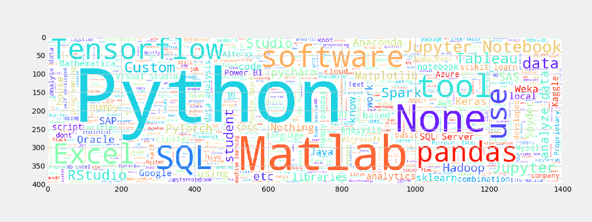

# 2018 Kaggle ML & DS Survey Challenge
Explore the 2018 Kaggle ML & Data Science Survey
[Link](https://www.kaggle.com/kaggle/kaggle-survey-2018/home) 

Kaggle is the world's largest community of data scientists and machine learners, owned by Google, Inc. Kaggle got its start by offering machine learning competitions and now also offers a public data platform, a cloud-based workbench for data science, and short form AI education.

## Data set Description
Welcome to Kaggle's second annual Machine Learning and Data Science Survey ― and our first-ever survey data challenge.

This year, as last year, we set out to conduct an industry-wide survey that presents a truly comprehensive view of the state of data science and machine learning. The survey was live for one week in October, and after cleaning the data we finished with 23,859 responses, a 49% increase over last year!

There's a lot to explore here. The results include raw numbers about who is working with data, what’s happening with machine learning in different industries, and the best ways for new data scientists to break into the field. We've published the data in as raw a format as possible without compromising anonymization, which makes it an unusual example of a survey dataset.

## Public Kernel
* [Data Science Survey - 2018](https://www.kaggle.com/sudhirnl7/data-science-survey-2018)

[nbviewer](https://nbviewer.jupyter.org/)

## Out come of project:
This project give good opportunity to explore data set.
