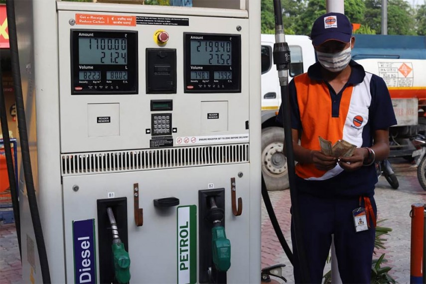

# Fuel Price In India
Daily diesel and petrol price data from 2002 to 2020.

| Project Name | Type  | Public Kernel | Date |
| ------ | ------ | ------ | ------ | 
| [Fuel Price In India](https://www.kaggle.com/sudhirnl7/fuel-price-in-india) | Time Series Data | NA | Jan-2021 |

### Context
The data is daily diesel price across the various city in India. The charge varies state to state has Indian state government levy extra tax on the fuel. The government changed over time. The new fuel charge update rule came into effect.

### Content
The data consist of the date, fuel price and city name. There are a total of seven cities, such as Bengaluru, Chennai, Mumbai, Hyderabad, Delhi, Kolkata and  Coimbatore. The fuel price is Indian rupees.

### Acknowledgements
The data is parsed from  [mypetrolprice.com](https://www.mypetrolprice.com/diesel-price-in-india.aspx). The code used to parse data is present in  [github repository](https://github.com/sudhirln92/kaggle-datasets-and-kernels/tree/master/fuel-price-in-india). 

### Inspiration
How to handle missing data in time-series data? 
What is the price change with respect to a global price change?

## Out come of project:
This project give good opportunity to explore data set.
