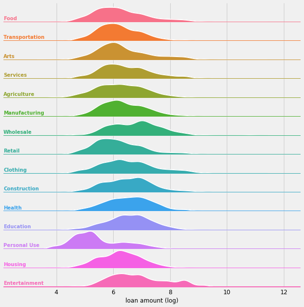

# Data Science for Good: Kiva Crowdfunding
To estimate welfare level of borrower in specific region. To analyse MPI(Multidimensional Poverty Index) in different part of world.

| Project Name | Type  | Public Kernel |
| ------ | ------ | ------ | 
| [Data Science for Good: Kiva Crowdfunding](https://www.kaggle.com/kiva/data-science-for-good-kiva-crowdfunding) | MPI(Multidimensional Poverty Index) analysis | [Kiva Welfare Loan](https://www.kaggle.com/sudhirnl7/kiva-welfare-loan/) |

Kiva.org is an online crowdfunding platform to extend financial services to poor and financially excluded people around the world. Kiva lenders have provided over $1 billion dollars in loans to over 2 million people. In order to set investment priorities, help inform lenders, and understand their target communities, knowing the level of poverty of each borrower is critical. However, this requires inference based on a limited set of information for each borrower. 

Kiva is a non-profit organization that allows anyone to lend money to people in need in over 80 countries. When you go to kiva.org, you can choose a theme (Refugees, Shelter, Health ...) or a country and you'll get a list of all the loans you can fund with a description of the borrower, his needs and the time he'll need for repayment. So far, Kiva has funded more than 1 billion dollars to 2 million borrowers and is considered a major actor in the fight against poverty, especially in many African countries.

## Data set Description
In this challenge, the ultimate goal is to obtain as precise informations as possible about the poverty level of each borrower / region because that would help setting investment priorities. Kagglers are invited to use Kiva's data as well as any external public datasets to build their poverty estimation model.

As for Kiva's data, here's what we've got :

kiva_loans : That's the dataset that contains most of the informations about the loans (id of borrower, amount of loan, time of repayment, reason for borrowing ...)
kiva_mpi_region_locations : This dataset contains the MPI of many regions (subnational) in the world.
loan_theme_ids : This dataset has the same unique_id as the kiva_loans (id of loan) and contains information about the theme of the loan.
loan_themes_by_region : This dataset contains specific informations about geolocation of the loans.

## Out come of project:
This project gives a good opportunity to explore the data set. It helps to understand the multidimensional poverty index of various country.
